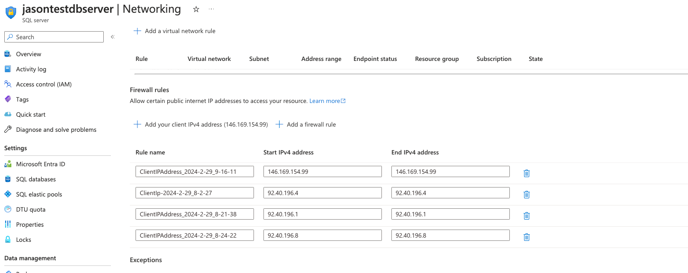

# Docker running

Installing pyodbc on an Apple M1 is difficult. Using Docker

## Docker Build
For apple mac then need to specify  --platform=linux/amd64 

This is done in the dockerfile for convenience. 

FROM --platform=linux/amd64  python:3.11.0-buster
```
docker build -t jasontestflaskname .
```
## Docker run

Run on mac:  
```
docker run -p 5000:5000 jasontestflaskname
```
## Use on localhost
```
http://localhost:5000/
```
This confirms the environment variables are working

### Test DB
```
http://localhost:5000/test
```
### Error (not an issue)
This error has gone away. I need to allow my IP address to access the database, something like this:



Error gone:
I receive the following error which appears to indicate the code is working but the connection is blocked for me.

```
sqlalchemy.exc.ProgrammingError: (pyodbc.ProgrammingError) ('42000', "[42000] [Microsoft][ODBC Driver 17 for SQL Server][SQL Server]Cannot open server 'sse-user-details-server' requested by the login. Client with IP address '86.20.33.146' is not allowed to access the server.  To enable access, use the Azure Management Portal or run sp_set_firewall_rule on the master database to create a firewall rule for this IP address or address range.  It may take up to five minutes for this change to take effect. (40615) (SQLDriverConnect)")
(Background on this error at: https://sqlalche.me/e/20/f405)
```